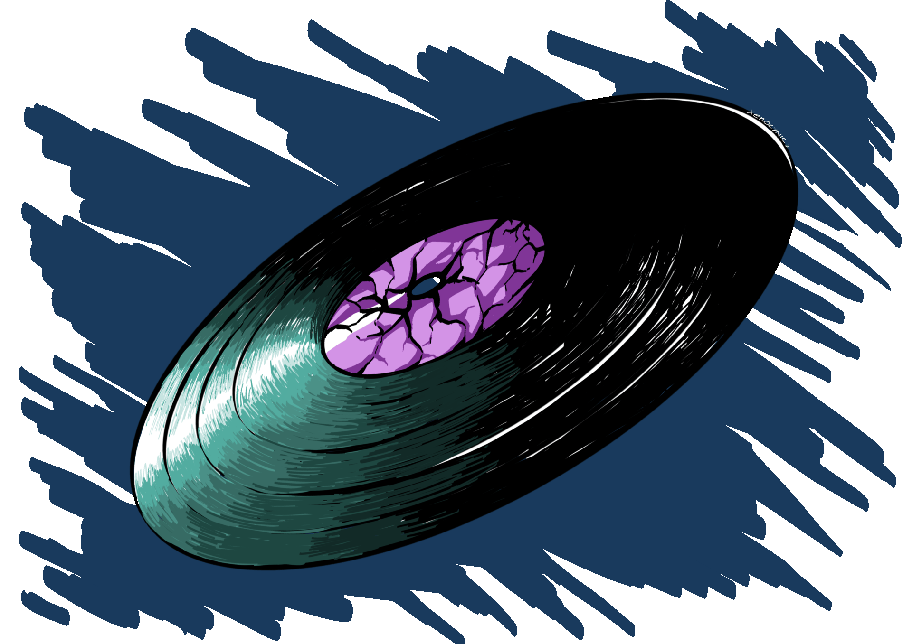

# Selena's Super Epic GitHub Profile 
Hello! Welcome. My name is **Selena Chainani**, and I'm a final year undergraduate student at the University of Alberta! I'm doing a *Computing Science Honors* degree paired with a *Certificate in Game Development*. This is where a sizable chunk of my projects are stowed away, so you're *probably* in the right place.

## What Do I Work With?
This is not an exhaustive list, but the following come to mind:

  
  
  
  
  
  
  
  
  
  

I like working on things where design and code have to work together: games, user interfaces, or systems that do something odd. (That last one is entirely self-serving, I think.) If I were more consistent with what I did, I'd add co-creative tools to that list, but alas. 

Outside of that, I'm generally motivated by the need to create things that can help people in some way - whether that's health tech or within an academic domain. I'll persevere and work towards picking up any skill needed in that pursuit. <h6>(This is how I ended up learning how to work with FastAPI in under 48 hours once.)</h6>

 

Anyway, here's a list of things I like to do:
- <b>Game Development and Design</b> (Unity, mainly; can use Godot and is learning UE5)
- <b>UI / UX Design</b>
- <b>Project Management</b> (I <3 creating schedules + pipelines + documentation)
- <b>Web Development</b> 
- <b>Games Artificial Intelligence</b> 
- <b>Data Analysis</b>
- <b>Dealing with Databases</b> (sometimes)

 

...and here's other things I like to do:
- <b>Art</b> (check out that little disc gif below :3)
- <b>Creative Writing</b> (fiction and the occasional thoughtful piece)
- <b>Sound Design</b>
- <b>Making Music</b>

 

<h3>I'll add a list of my favorite projects eventually. But, in the meantime, check out the links on the left!</h3>

 

 

<!-- disc-s -->
<table>
  <tr>
    <td>
      
    </td>
    <td align="center">
      <h1>
        <code> ✦ siren's call ✦ </code>
      </h1>
      &nbsp;&nbsp;<code> [I also don't know the contents of my Spotify Liked Songs, so everyday is a mystery~] </code>&nbsp;&nbsp;&nbsp;&nbsp;
      <h2>&nbsp;&nbsp;
        today's music recommendation (updates everyday!)
      &nbsp;&nbsp;&nbsp;&nbsp;</h2>
      <code>> <b> Gallons Of Rubbing Alcohol Flow Through The Strip </b></code>
       
      
        <code>Nirvana</code>
      
      <h1> </h1>
    </td>
  </tr>
</table>

<!-- disc-e -->

